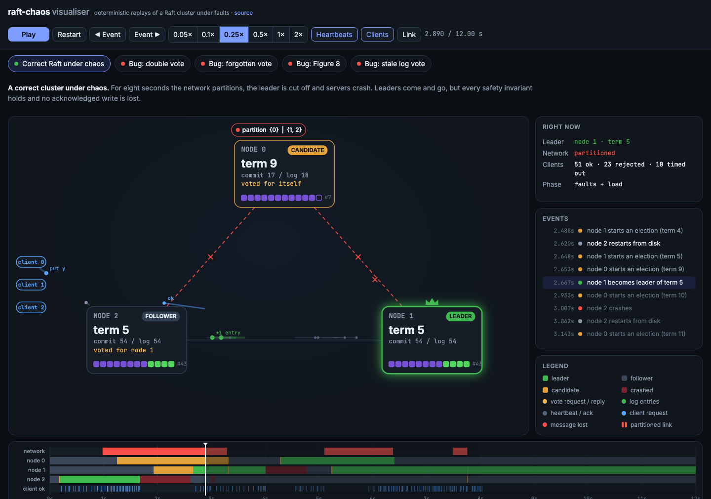
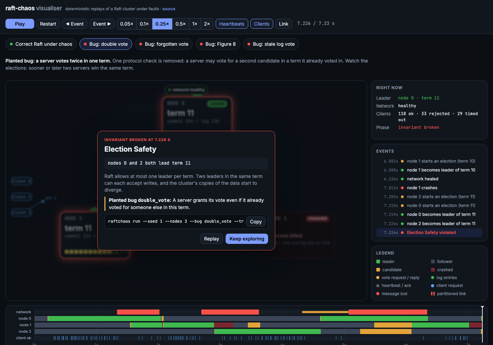
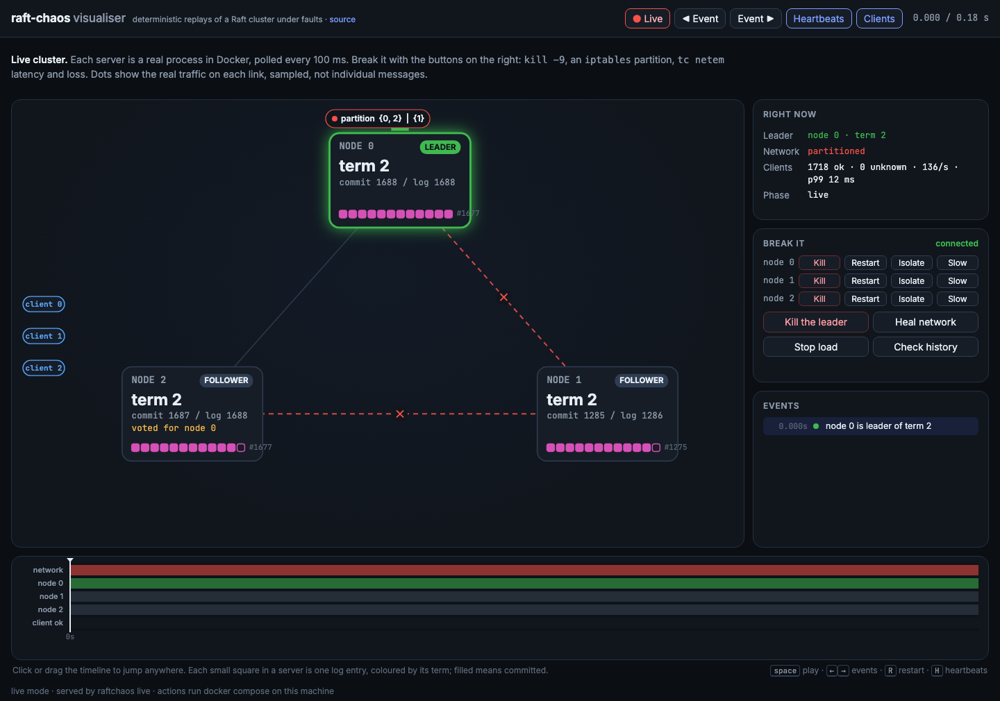
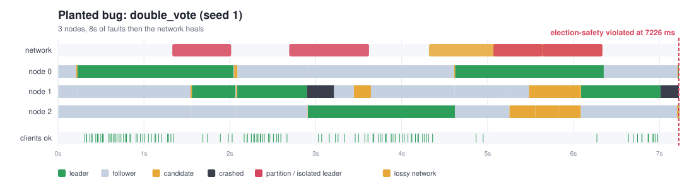
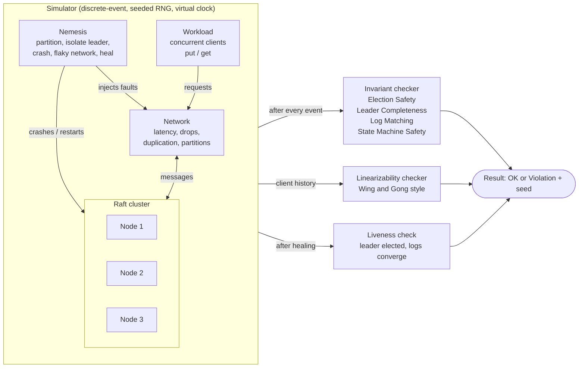
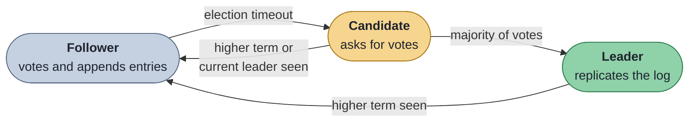

<div align="center">

# raft-chaos

**Raft consensus in pure Python, broken on purpose by a deterministic chaos simulator.**

**[▶ Watch it fail in your browser](https://iamvinbas.github.io/raft-chaos/viz/)**

[](https://github.com/iamvinbas/raft-chaos/actions)
[](https://www.python.org/)
[](LICENSE)
[](pyproject.toml)
[](pyproject.toml)

</div>

`raft-chaos` implements Raft leader election and log replication for a replicated
key-value store, then attacks it with partitions, crashes, packet loss and
duplication. Every step is checked against Raft's safety invariants and a
linearizability checker. When something breaks, you get a **seed** that replays
the exact same failure, every time.

## Results at a glance

- **All 6 planted Raft bugs are found**, each with a seed that replays the failure. Random faults
  find 4; targeted faults find the other 2 (double vote after a restart, and Figure 8 of the Raft paper).
- **No false alarms:** a correct node passes 2000 adversarial seeds with 3 nodes and 2000 with 5.
- **Bugs in its own tooling:** the simulator caught two real defects in this project (duplicated
  requests applied twice, and a wrong assumption in the checker), written up [below](#bugs-the-simulator-found-in-this-project).
- **Also works for real:** the same node runs over TCP. In Docker, with `kill -9`, `tc netem` and
  an `iptables` partition applied during the run, the history of 4240 operations was linearizable.
- **Found, measured, fixed:** the real cluster exposed three availability problems: term inflation,
  a quadratic storage layer and TCP retransmission stalls. Each was fixed and remeasured; PreVote
  was also proven in the simulator (50/50 runs disrupted without it, 0/50 with it).
- **See it happen:** an interactive visualiser replays any run, message by message, and stops on
  the event that breaks an invariant.
- **Observability:** Prometheus metrics, SLO error budgets, anomaly detection and SVG timelines.
- Standard library only at runtime, strict `mypy`, CI on Python 3.10 and 3.12.

<div align="center">



<sub>The visualiser replaying a correct cluster under chaos. Node 0 is partitioned away and keeps
starting elections (term 9) while nodes 1 and 2 elect a leader and keep committing.</sub>

</div>

## Watch it fail

**Live demo: [iamvinbas.github.io/raft-chaos/viz](https://iamvinbas.github.io/raft-chaos/viz/)**, no install needed.

`raftchaos viz` turns any run into an interactive page: one HTML file, no server, no build step.

```bash
raftchaos viz --out viz.html --open                              # the seven demo scenes
raftchaos viz --seed 4 --bug forget_vote_on_restart --profile adversarial --out run.html --open
```

What you see:

- **Servers** with their role, term, commit index, vote and the tail of their log. Each square is
  a log entry coloured by its term, so diverging logs are visible at a glance.
- **Messages in flight**: vote requests, log entries, heartbeats and client requests, each with
  its own colour. A lost message stops half way and bursts red.
- **Faults**: partitioned links turn into red dashed lines with a cut mark, crashed servers go
  dark, lossy links flicker amber.
- **A timeline** of every server's role, the faults and client successes. Click or drag to jump.
- **The moment it breaks**: playback stops on the violating event and explains the invariant,
  the planted bug and the command that reproduces it.

<div align="center">



<sub>Planted bug <code>double_vote</code>: nodes 0 and 2 both become leader of term 11.</sub>

</div>

### Live mode: break a real cluster from the browser

The same page can watch the Docker cluster in real time and break it with buttons: `kill -9` a
node or the leader, cut one off with `iptables`, slow one down with `tc netem`, heal. It also runs a
client load and, on demand, checks that load's history for linearizability.

```bash
docker compose up -d --build
raftchaos live --open          # serves http://127.0.0.1:8080, polls every node every 100 ms
```

<div align="center">



<sub>Live: node 1 is cut off by <code>iptables</code> and stuck at commit 1285, while the other two
keep committing at 136 operations per second.</sub>

</div>

Node state is exact; the dots are drawn from per-link frame counters, so they show real traffic
volume rather than single messages. The bridge binds to 127.0.0.1, rejects foreign `Host` headers
and requires a per-run token on every call, so another website cannot drive your Docker.

**What each mode needs.**

| Mode | Where it runs | Needs |
| --- | --- | --- |
| Replay | anywhere, including the [public page](https://iamvinbas.github.io/raft-chaos/viz/) | nothing: the recorded runs are inside the page |
| Live, with fault buttons | `raftchaos live` on your machine | the Docker Compose cluster, since the buttons run `docker compose` |
| Live, watch only | `raftchaos live --no-faults --nodes … --metrics …` | any running cluster, for example three `raftchaos node` processes; break it by hand with `kill -9` |

Run one cluster at a time on a given set of ports. On macOS, local nodes can bind
`127.0.0.1:7100` while Docker holds the same port on all addresses, and the bridge would then
silently read a mix of the two clusters.

**Why the public page has no live mode.** A static page cannot start processes or reach Docker,
so live mode needs your machine. The browser could run the same `node.py` through Pyodide (Python
compiled to WebAssembly), and visitors could then break a cluster without installing anything. It
was left out on purpose: those faults would hit a simulated network and clock, not real processes,
sockets, `fsync` and `iptables`, which is what live mode exists to show. The simulated side is
already covered by the replays, which are reproducible and checked by the invariant checker.

Links carry the scene and the moment, for example `viz.html#double-vote@7200`, so a failure can
be shared exactly. The demo page is committed as [docs/viz/index.html](docs/viz/index.html), and a
test fails if it drifts from what the code produces.

## Why this exists

Distributed systems rarely fail on the happy path. They fail when a leader is
partitioned mid-commit, a node restarts at the wrong moment, or the network
delivers a message twice. Those failures are hard to reproduce, so they are hard
to fix.

This project treats reliability as something you can test:

- **Inject failures** systematically instead of hoping they happen.
- **Check invariants continuously**, after every simulated event, not only at the end.
- **Make every failure reproducible** from a single integer.
- **Prove the tester works** by re-introducing classic Raft bugs and confirming they get caught.

## Quickstart

```bash
git clone https://github.com/iamvinbas/raft-chaos.git
cd raft-chaos
python -m venv .venv && source .venv/bin/activate
pip install -e ".[dev]"

raftchaos run --seed 3                    # one deterministic run, correct Raft
raftchaos run --seed 1 --bug double_vote --trace   # a failing run, with the fault timeline
raftchaos hunt --all --seeds 200 --jobs 2 # scan seeds for every injectable bug
raftchaos hunt --all --profile adversarial --seeds 500 --jobs 2   # targeted faults
raftchaos slo --seed 7                    # SLO and error-budget report
raftchaos anomalies --seed 7              # anomalous windows, attributed to faults
raftchaos metrics --seed 7                # Prometheus text format
raftchaos timeline --seed 7 --out run.svg # draw the run
raftchaos viz --out viz.html --open       # interactive visualiser
raftchaos experiment prevote --seeds 50   # isolated node, with and without PreVote
raftchaos live --open                     # watch and break the Docker cluster
raftchaos bugs                            # list injectable bugs
```

> Every new terminal window starts without the virtual environment: run
> `source .venv/bin/activate` again from the `raft-chaos` folder, or `raftchaos` and `pytest`
> will be "command not found".

Useful flags: `--nodes N` (cluster size), `--duration MS`, `--history` (print the client
operation history), `--jobs N` (parallel worker processes for `hunt`),
`--profile adversarial` (targeted faults, see below).

### A clean run

```console
$ raftchaos run --seed 3
seed 3, 3 nodes, bug=none
stats: committed=147, crashes=4, elections=7, msgs_dropped=276, msgs_sent=2046, ops_fail=21, ops_info=34, ops_ok=134, ops_pending=0, partitions=4
OK: all invariants held and the history is linearizable
```

Four crashes, four partitions and seven elections later, the cluster still agrees.

### A caught bug

```console
$ raftchaos run --seed 1 --bug double_vote --trace
...
[  5638ms] isolate leader 0
[  6336ms] heal network
[  6698ms] heal network
[  7012ms] crash node 1
seed 1, 3 nodes, bug=double_vote
stats: committed=134, crashes=2, elections=7, msgs_dropped=238, msgs_sent=1655, ops_fail=33, ops_info=29, ops_ok=118, ops_pending=3, partitions=4
VIOLATION [7226ms] election-safety: nodes 0 and 2 both lead term 11
reproduce: raftchaos run --seed 1 --nodes 3 --bug double_vote --trace
```

### Hunting for bugs

```console
$ raftchaos hunt --all --seeds 200 --jobs 2
bug                          seed  tried    time  violation
none                            -    200   12.9s  none found
double_vote                     1      2    0.4s  election-safety
stale_log_vote                  0      1    0.1s  leader-completeness
commit_without_majority         0      1    0.1s  state-machine-safety
commit_old_term                 -    200   13.3s  none found
no_truncate_on_conflict         0      1    0.1s  state-machine-safety
forget_vote_on_restart          -    200   13.1s  none found
```

The `none` row is the control: a correct node must never fail. Timings depend on your machine.

Two bugs survive random faults because they need a rare interleaving. The `adversarial`
profile adds faults that fire on an event instead of on a timer, and finds all six:

```console
$ raftchaos hunt --all --profile adversarial --seeds 500 --jobs 2
bug                          seed  tried    time  violation
none                            -    500   10.6s  none found
double_vote                     1      2    0.2s  election-safety
stale_log_vote                  0      1    0.1s  leader-completeness
commit_without_majority         0      1    0.1s  state-machine-safety
commit_old_term                61     62    1.5s  leader-completeness
no_truncate_on_conflict         0      1    5.2s  liveness
forget_vote_on_restart          4      5    0.2s  election-safety
```

The `adversarial` profile combines three changes:

- **Crash after voting.** A node that grants a vote is crashed right away (50% chance) and
  restarts within 10-80 ms, so a node that forgets its vote can vote twice in one term.
- **Torn broadcast.** A leader that sends new entries is crashed after only one follower
  received them (15% chance). This is the setup of Figure 8 in the Raft paper.
- **Tight timing.** Election timeouts of 150-180 ms produce frequent split votes, and
  append messages carry one entry, so a partly replicated log is common.

The correct node passes 2000 adversarial seeds with 3 nodes and 2000 with 5 nodes.

## Metrics, SLOs and anomalies

The simulator also measures the service the way a client sees it, on the same virtual clock, so
the numbers reproduce from a seed. `raftchaos metrics`, `slo`, `anomalies` and `timeline` give:

- **Prometheus metrics:** operation outcomes, latency histogram, availability, longest outage.
- **SLO error budgets**, steady state against chaos. On seed 7 the cluster meets all three
  objectives without faults; under chaos availability is 0.812 against a 0.90 target (188% of the
  budget), while p99 latency and the longest outage stay within budget.
- **Anomaly detection** that names the injected fault behind each flagged window. It flags 1.5% of
  windows on fault-free runs and 25% under chaos (seeds 0-29): a baseline detector, not a production one.
- **SVG timelines**, like the one below, where a red line marks the moment an invariant broke.

<div align="center">



</div>

Commands, sample output and how each number is computed: [docs/observability.md](docs/observability.md).

## Run it for real

The simulator tests the protocol. The same `RaftNode` also runs as a real service over TCP, with
its term, vote and log fsynced to disk before any reply is sent, and Prometheus `/metrics` on
every node. `raftchaos verify` then drives concurrent clients against the live cluster and checks
the recorded history with the same linearizability checker.

On three local processes, with the leader and then a follower killed by `kill -9` mid-run:

```console
$ raftchaos verify --nodes $PEERS --seconds 14 --clients 3
1285 operations acknowledged, 0 with unknown outcome, 14.1s
OK: the history is linearizable
```

Setup, the Docker Compose cluster and the chaos script are in
[docs/real-cluster.md](docs/real-cluster.md). The Docker chaos demo ran end to end: `kill -9`,
`tc netem` and an `iptables` partition, with a linearizable history of 4240 operations.

Running it for real also found three problems the simulator could not see or had not been asked
about, each fixed and remeasured:

| Symptom | Fix | Before | After |
| --- | --- | --- | --- |
| A rejoining node forced needless elections | PreVote | term 69, 2 extra elections | term 2, none |
| Slow catch-up after a partition | Append-only write-ahead log | ~14 s | under 5 s |
| Stale leader after healing | `TCP_USER_TIMEOUT` on peer sockets | 2-3 s | under 1 s |
| A client accepted a late reply to a request it had abandoned | Match replies by request id | a `get` returned another key's value | test passes |

Details, and the PreVote experiment over 50 seeds: [docs/real-cluster.md](docs/real-cluster.md#findings-from-the-real-cluster).

## Architecture



A run has three phases: **load + faults** (`duration_ms`), then **settle** (the network
heals and every node restarts), then the **final checks** (liveness and linearizability).

### Raft roles



| Role | What it does |
| --- | --- |
| Follower | Grants at most one vote per term and appends entries sent by the leader. |
| Candidate | Starts an election in a new term. After a split vote it times out and tries again in the next term. |
| Leader | Accepts client requests, replicates them, and commits once a majority has them. |

## Key terms

| Term | Meaning here |
| --- | --- |
| **Raft** | A consensus algorithm: several servers keep the same log of commands, and keep working while a minority fails. |
| **Term** | Raft's logical clock. Each election starts a new term, and a term has at most one leader. |
| **Invariant** | A property that must hold at every moment. A violation is always a bug, whatever the network does. |
| **Linearizability** | The store behaves as if every operation happened at one instant between its start and its reply. A stale read after an acknowledged write breaks it. |
| **Nemesis** | The part of the simulator that injects faults: partitions, crashes, packet loss. |
| **Seed** | The integer that fixes every random choice in a run, so a failure can be replayed exactly. |
| **Deterministic simulation** | Running the system on a virtual clock and a fake network, so runs are fast and reproducible. |
| **PreVote** | An extra round before an election: a node first asks whether it *would* get votes, without changing anyone's term. A node that cannot win never disturbs the others. |
| **SLO and error budget** | A reliability target (for example 90% availability) and the share of allowed failure a run has used. |

## Determinism: same seed, same run

`node.py` is a **pure state machine**: it takes an event (message, tick) and returns
messages to send. It does no I/O and never reads a clock or a global RNG. All time is
virtual and all randomness (latency, drops, duplicates, nemesis choices, client behaviour)
comes from seeded generators derived from the one seed, in `sim.py`.

So the result of a run is a function of `(seed, config, bugs)` and nothing else. A failure
found on one machine replays identically on another, which turns "it failed once in CI"
into a debuggable, committable test case.

## Reproducing a failure

1. `raftchaos hunt --bug stale_log_vote --seeds 1000` prints a failing seed.
2. `raftchaos run --seed <seed> --bug stale_log_vote --trace --history` replays it with the
   nemesis timeline and the client history.
3. Fix the code, re-run the same command, then pin the seed as a regression test.

On any failure the CLI prints the exact `reproduce:` command for you.

## Injectable bugs

Each flag in `bugs.py` re-introduces a classic Raft mistake. If the simulator cannot find them,
it cannot be trusted to find the ones you did not plant.

| Bug | What it breaks | Caught by | Default profile (seeds 0-1499) | Adversarial profile |
| --- | --- | --- | --- | --- |
| `double_vote` | Grants a vote even if already voted in this term | Election Safety | Seed 1 | Seed 1 |
| `stale_log_vote` | Skips the "candidate log is up to date" vote check | Leader Completeness | Seed 0 | Seed 0 |
| `commit_without_majority` | Leader commits with one replica fewer than a majority | State Machine Safety | Seed 0 | Seed 0 |
| `no_truncate_on_conflict` | Follower keeps conflicting log entries | State Machine Safety, liveness | Seed 0 | Seed 0 |
| `commit_old_term` | Commits earlier-term entries by counting replicas (Raft paper, Figure 8) | Leader Completeness | Not found | Seed 61 |
| `forget_vote_on_restart` | `voted_for` is not persisted across a restart | Election Safety | Not found | Seed 4 |

Seeds are for 3 nodes. With 5 nodes the adversarial profile finds all six as well
(`commit_old_term` at seed 429). Random faults alone miss the last two bugs, which is why the
targeted profile exists: a test suite that cannot find planted bugs cannot be trusted to find
unplanted ones.

Control result: with the default profile a correct node stayed clean on 1500 seeds with 3 nodes
and 1000 seeds with 5 nodes.

## Bugs the simulator found in this project

**Seed 913 failed linearizability on a correct cluster.** Writing this up postmortem-style:

- **Symptom:** a key rolled back to an older value; the checker reported a non-linearizable history.
- **Root cause 1:** the network can duplicate a client request, so the same `put` was
  committed twice and overwrote a newer write.
- **Fix 1:** per-client sessions. Each request carries `(client, req_id)` and the state
  machine deduplicates it in `node.py` (`_apply`).
- **Root cause 2:** the test harness assumed a `put` rejected by a non-leader was "definitely
  not executed". But a duplicated copy may already have been appended by a leader that then
  stepped down.
- **Fix 2:** rejected puts are recorded as *indeterminate* in the history (`workload.py`).
- **Regression test:** `tests/test_simulation.py::test_duplicated_client_requests_do_not_break_linearizability`.

Lesson: the second bug was in the checker's assumptions, not in Raft. Test tooling needs
the same scepticism as the system under test.

## Project layout

```text
raft-chaos/
├── src/raftchaos/
│   ├── node.py            # Raft node: pure state machine, no I/O, no clock
│   ├── messages.py        # immutable wire messages and log entries
│   ├── sim.py             # discrete-event simulator, network model, nemesis
│   ├── invariants.py      # Election Safety, Leader Completeness, Log Matching, SM Safety
│   ├── linearizability.py # Wing and Gong style history checker
│   ├── workload.py        # concurrent clients producing the history
│   ├── bugs.py            # the 6 injectable protocol bugs
│   ├── metrics.py         # latency, availability, outage; Prometheus text format
│   ├── slo.py             # SLOs and error-budget accounting
│   ├── anomaly.py         # robust z-score detector, fault attribution
│   ├── timeline_svg.py    # SVG timeline of roles, faults and client successes
│   ├── recorder.py        # opt-in recording of a run for replay
│   ├── experiments.py     # scripted-fault experiments (PreVote)
│   ├── viz/               # the web visualiser: template + builder
│   ├── runtime/           # the same node over real TCP: server, client, storage, verify
│   ├── live/              # bridge between the browser and a running cluster
│   └── cli.py             # run, hunt, viz, experiment, metrics, slo, anomalies, …
├── tests/                 # simulation, linearizability and observability tests
├── docs/design.md         # invariants and design decisions
├── docs/observability.md  # metrics, SLOs, anomaly detection, timelines
├── docs/real-cluster.md   # running and breaking a real cluster
├── docs/viz/index.html    # the visualiser with the demo scenes
├── docs/img/, docs/*.svg  # images used in this README
├── Dockerfile, docker-compose.yml, docker/
├── scripts/chaos-demo.sh  # kill, tc netem and iptables against the compose cluster
└── .github/workflows/ci.yml
```

## Testing and CI

```bash
pytest -q          # unit, simulation and real-TCP tests; the planted bugs must be caught
ruff check .       # lint
ruff format --check .
mypy               # strict type checking
```

Run these from the `raft-chaos` folder with the environment active. From a parent folder,
`pytest` collects every project below it and fails with collection errors. From anywhere:
`.venv/bin/pytest -q tests`.

CI runs lint, strict mypy and pytest on Python 3.10 and 3.12 for every push and pull request.

## Limitations and roadmap

**Current limitations**

- No log compaction or snapshots, and no cluster membership changes.
- The simulator uses a simulated network. The real runtime was run on localhost and once in
  Docker on macOS; the Docker chaos script is not part of CI.
- PreVote is on by default in the real runtime and off by default in the simulator, so the
  published seeds stay reproducible. `--pre-vote` turns it on in any simulator command.
- No authentication or TLS on the node ports.
- The default profile misses two of the six planted bugs; use `--profile adversarial`.
- Single-key operations only; the linearizability checker is exponential in the worst case.

**Done since the first release:** Prometheus metrics, SLO report, anomaly detection, SVG
timelines, a real TCP runtime with durable storage, a linearizability check of a live cluster,
an interactive visualiser with a live mode, and PreVote.

**Planned**

- [ ] Snapshots and cluster membership changes

## References

- Ongaro and Ousterhout, [In Search of an Understandable Consensus Algorithm](https://raft.github.io/raft.pdf)
- Wing and Gong, *Testing and Verifying Concurrent Objects* (1993)
- [Jepsen](https://jepsen.io/) for the fault-injection philosophy

## License

MIT, see [LICENSE](LICENSE).
