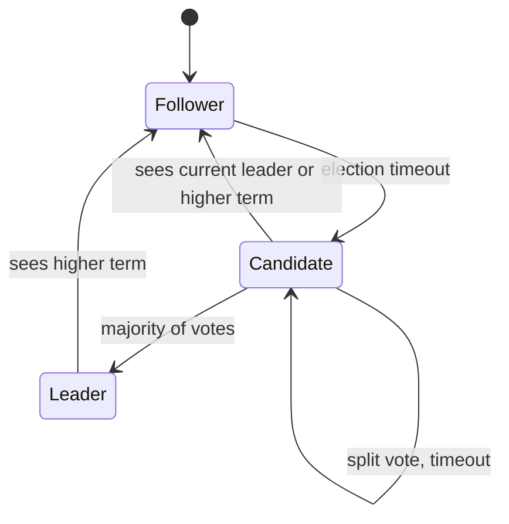

<div align="center">

# raft-chaos

**Raft consensus in pure Python, broken on purpose by a deterministic chaos simulator.**

[](https://github.com/iamvinbas/raft-chaos/actions)
[](https://www.python.org/)
[](LICENSE)
[](pyproject.toml)
[](pyproject.toml)

</div>

`raft-chaos` implements Raft leader election and log replication for a replicated
key-value store, then attacks it with partitions, crashes, packet loss and
duplication. Every step is checked against Raft's safety invariants and a
linearizability checker. When something breaks, you get a **seed** that replays
the exact same failure, every time.

## Why this exists

Distributed systems rarely fail on the happy path. They fail when a leader is
partitioned mid-commit, a node restarts at the wrong moment, or the network
delivers a message twice. Those failures are hard to reproduce, so they are hard
to fix.

This project treats reliability as something you can test:

- **Inject failures** systematically instead of hoping they happen.
- **Check invariants continuously**, after every simulated event, not only at the end.
- **Make every failure reproducible** from a single integer.
- **Prove the tester works** by re-introducing classic Raft bugs and confirming they get caught.

## Quickstart

```bash
git clone https://github.com/iamvinbas/raft-chaos.git
cd raft-chaos
python -m venv .venv && source .venv/bin/activate
pip install -e ".[dev]"

raftchaos run --seed 3                    # one deterministic run, correct Raft
raftchaos run --seed 1 --bug double_vote --trace   # a failing run, with the fault timeline
raftchaos hunt --all --seeds 200 --jobs 2 # scan seeds for every injectable bug
raftchaos hunt --all --profile adversarial --seeds 500 --jobs 2   # targeted faults
raftchaos bugs                            # list injectable bugs
```

Useful flags: `--nodes N` (cluster size), `--duration MS`, `--history` (print the client
operation history), `--jobs N` (parallel worker processes for `hunt`),
`--profile adversarial` (targeted faults, see below).

### A clean run

```console
$ raftchaos run --seed 3
seed 3, 3 nodes, bug=none
stats: committed=147, crashes=4, elections=7, msgs_dropped=276, msgs_sent=2046, ops_fail=21, ops_info=34, ops_ok=134, ops_pending=0, partitions=4
OK: all invariants held and the history is linearizable
```

Four crashes, four partitions and seven elections later, the cluster still agrees.

### A caught bug

```console
$ raftchaos run --seed 1 --bug double_vote --trace
...
[  5638ms] isolate leader 0
[  6336ms] heal network
[  6698ms] heal network
[  7012ms] crash node 1
seed 1, 3 nodes, bug=double_vote
stats: committed=134, crashes=2, elections=7, msgs_dropped=238, msgs_sent=1655, ops_fail=33, ops_info=29, ops_ok=118, ops_pending=3, partitions=4
VIOLATION [7226ms] election-safety: nodes 0 and 2 both lead term 11
reproduce: raftchaos run --seed 1 --nodes 3 --bug double_vote --trace
```

### Hunting for bugs

```console
$ raftchaos hunt --all --seeds 200 --jobs 2
bug                          seed  tried    time  violation
none                            -    200   12.9s  none found
double_vote                     1      2    0.4s  election-safety
stale_log_vote                  0      1    0.1s  leader-completeness
commit_without_majority         0      1    0.1s  state-machine-safety
commit_old_term                 -    200   13.3s  none found
no_truncate_on_conflict         0      1    0.1s  state-machine-safety
forget_vote_on_restart          -    200   13.1s  none found
```

The `none` row is the control: a correct node must never fail. Timings depend on your machine.

Two bugs survive random faults because they need a rare interleaving. The `adversarial`
profile adds faults that fire on an event instead of on a timer, and finds all six:

```console
$ raftchaos hunt --all --profile adversarial --seeds 500 --jobs 2
bug                          seed  tried    time  violation
none                            -    500   10.6s  none found
double_vote                     1      2    0.2s  election-safety
stale_log_vote                  0      1    0.1s  leader-completeness
commit_without_majority         0      1    0.1s  state-machine-safety
commit_old_term                61     62    1.5s  leader-completeness
no_truncate_on_conflict         0      1    5.2s  liveness
forget_vote_on_restart          4      5    0.2s  election-safety
```

The `adversarial` profile combines three changes:

- **Crash after voting.** A node that grants a vote is crashed right away (50% chance) and
  restarts within 10-80 ms, so a node that forgets its vote can vote twice in one term.
- **Torn broadcast.** A leader that sends new entries is crashed after only one follower
  received them (15% chance). This is the setup of Figure 8 in the Raft paper.
- **Tight timing.** Election timeouts of 150-180 ms produce frequent split votes, and
  append messages carry one entry, so a partly replicated log is common.

The correct node passes 2000 adversarial seeds with 3 nodes and 2000 with 5 nodes.

## Architecture


A run has three phases: **load + faults** (`duration_ms`), then **settle** (the network
heals and every node restarts), then the **final checks** (liveness and linearizability).

### Raft roles



## Determinism: same seed, same run

`node.py` is a **pure state machine**: it takes an event (message, tick) and returns
messages to send. It does no I/O and never reads a clock or a global RNG. All time is
virtual and all randomness (latency, drops, duplicates, nemesis choices) comes from one
seeded generator in `sim.py`.

So the result of a run is a function of `(seed, config, bugs)` and nothing else. A failure
found on one machine replays identically on another, which turns "it failed once in CI"
into a debuggable, committable test case.

## Reproducing a failure

1. `raftchaos hunt --bug stale_log_vote --seeds 1000` prints a failing seed.
2. `raftchaos run --seed <seed> --bug stale_log_vote --trace --history` replays it with the
   nemesis timeline and the client history.
3. Fix the code, re-run the same command, then pin the seed as a regression test.

On any failure the CLI prints the exact `reproduce:` command for you.

## Injectable bugs

Each flag in `bugs.py` re-introduces a classic Raft mistake. If the simulator cannot find them,
it cannot be trusted to find the ones you did not plant.

| Bug | What it breaks | Caught by | Default profile (seeds 0-1499) | Adversarial profile |
| --- | --- | --- | --- | --- |
| `double_vote` | Grants a vote even if already voted in this term | Election Safety | Seed 1 | Seed 1 |
| `stale_log_vote` | Skips the "candidate log is up to date" vote check | Leader Completeness | Seed 0 | Seed 0 |
| `commit_without_majority` | Leader commits with one replica fewer than a majority | State Machine Safety | Seed 0 | Seed 0 |
| `no_truncate_on_conflict` | Follower keeps conflicting log entries | State Machine Safety, liveness | Seed 0 | Seed 0 |
| `commit_old_term` | Commits earlier-term entries by counting replicas (Raft paper, Figure 8) | Leader Completeness | Not found | Seed 61 |
| `forget_vote_on_restart` | `voted_for` is not persisted across a restart | Election Safety | Not found | Seed 4 |

Seeds are for 3 nodes. With 5 nodes the adversarial profile finds all six as well
(`commit_old_term` at seed 429). Random faults alone miss the last two bugs, which is why the
targeted profile exists: a test suite that cannot find planted bugs cannot be trusted to find
unplanted ones.

Control result: a correct node stayed clean on all 1500 seeds with 3 nodes and 1000 seeds with 5 nodes.

## Bugs the simulator found in this project

**Seed 913 failed linearizability on a correct cluster.** Writing this up postmortem-style:

- **Symptom:** a key rolled back to an older value; the checker reported a non-linearizable history.
- **Root cause 1:** the network can duplicate a client request, so the same `put` was
  committed twice and overwrote a newer write.
- **Fix 1:** per-client sessions. Each request carries `(client, req_id)` and the state
  machine deduplicates it in `node.py` (`_apply`).
- **Root cause 2:** the test harness assumed a `put` rejected by a non-leader was "definitely
  not executed". But a duplicated copy may already have been appended by a leader that then
  stepped down.
- **Fix 2:** rejected puts are recorded as *indeterminate* in the history (`workload.py`).
- **Regression test:** `tests/test_simulation.py::test_duplicated_client_requests_do_not_break_linearizability`.

Lesson: the second bug was in the checker's assumptions, not in Raft. Test tooling needs
the same scepticism as the system under test.

## Project layout

```text
raft-chaos/
├── src/raftchaos/
│   ├── node.py            # Raft node: pure state machine, no I/O, no clock
│   ├── messages.py        # immutable wire messages and log entries
│   ├── sim.py             # discrete-event simulator, network model, nemesis
│   ├── invariants.py      # Election Safety, Leader Completeness, Log Matching, SM Safety
│   ├── linearizability.py # Wing and Gong style history checker
│   ├── workload.py        # concurrent clients producing the history
│   ├── bugs.py            # the 6 injectable protocol bugs
│   └── cli.py             # `raftchaos run | hunt | bugs`
├── tests/                 # simulation and linearizability tests
├── docs/design.md         # invariants and design decisions
└── .github/workflows/ci.yml
```

## Testing and CI

```bash
pytest -q          # unit + simulation tests (incl. the four findable injected bugs must be caught)
ruff check .       # lint
ruff format --check .
mypy               # strict type checking
```

CI runs lint, strict mypy and pytest on Python 3.10 and 3.12 for every push and pull request.

## Limitations and roadmap

**Current limitations**

- No log compaction or snapshots, and no cluster membership changes.
- The network is simulated; nodes do not talk over real sockets yet.
- The default profile misses two of the six planted bugs; use `--profile adversarial`.
- Single-key operations only; the linearizability checker is exponential in the worst case.

**Planned**

- [ ] Prometheus metrics and an SLO report (availability, election time, commit latency)
- [ ] Anomaly detection over run statistics
- [ ] Docker Compose demo with real fault injection via `tc` / `iptables`
- [ ] Web visualiser for timelines and histories

## References

- Ongaro and Ousterhout, [In Search of an Understandable Consensus Algorithm](https://raft.github.io/raft.pdf)
- Wing and Gong, *Testing and Verifying Concurrent Objects* (1993)
- [Jepsen](https://jepsen.io/) for the fault-injection philosophy

## License

MIT, see [LICENSE](LICENSE).
